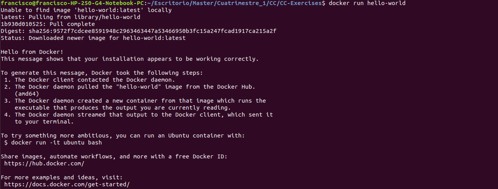
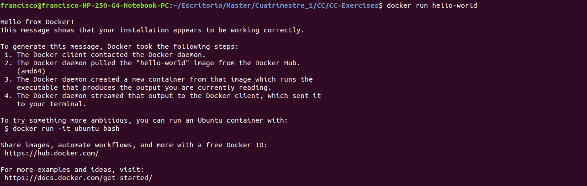
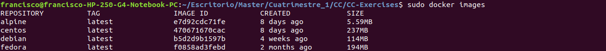

# Contenedores y cómo usarlos

**Ejercicio 1**

>Buscar alguna demo interesante de Docker y ejecutarla localmente, o en su defecto, ejecutar la imagen anterior y ver cómo funciona y los procesos que se llevan a cabo la primera vez que se ejecuta y las siguientes ocasiones.

Vamos a usar una imagen de ejemplo llamada hello-world. La primera vez que hacemos docker run hello-world, intentará encontrar la imagen localmente, pero como no se encuentra, la acaba descargando de Docker Hub.

La segunda vez que ejecutamos vemos que ya no la descarga, debido a que la encontrado localmente.

**Ejercicio 2**

>Tomar algún programa simple, “Hola mundo” impreso desde el intérprete de línea de órdenes, y comparar el tamaño de las imágenes de diferentes sistemas operativos base, Fedora, CentOS y Alpine, por ejemplo.

**Ejercicio 3**

>Crear a partir del contenedor anterior una imagen persistente con commit.

**Ejercicio 4**

>Examinar la estructura de capas que se forma al crear imágenes nuevas a partir de contenedores que se hayan estado ejecutando.

**Ejercicio 5**

>Crear un volumen y usarlo, por ejemplo, para escribir la salida de un programa determinado.
